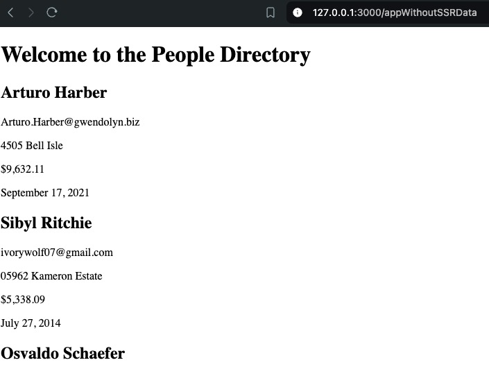

# Amex Code Challenge

This is a broken application meant to be given to a potential new hire to assess their abilities.

## Description

This is a node-based application. It contains a barebones webserver and a mock API to be consumed by both the client- and server-side applications. It renders a homepage as well as 2 routes. The first route is a normal client-side application that fetches some data about people and renders that data to the page. The second route provides the same functionality but it pre-fetches the data server-side such that the page can render even faster client-side and the page can render even without the use of javascript client-side.

## Getting Started

* The application does not contain a test suite.
* Run `npm i` to install dependencies.
* Run `npm start` to build the application and start a minimal webserver. It should open a port at `localhost:3000` where you can visit the site.
* The application does not contain a method of deployment. This is NOT meant to be run in a production environment.

## Research, Notes, Next Steps

* I actually did basically this same thing before: https://github.com/jacopotarantino/angular-templateloader
* Depending on your needs, https://developer.mozilla.org/en-US/docs/Web/API/Request/cache might be sufficient for client-side caching. It won't work for server-side caching or cases where you need more exacting control.
* https://cacheable.org/ provides a lot of the features desired here but doesn't seem to support serialization or fetching all keys directly.

* I would really have preferred an application with an automated test suite but the comments were mostly sufficient for providing acceptance criteria.
* I corrected some function calls and type notations to reduce boilerplate and complicated interface descriptions.
* I removed extraneous calls to cachingFetch. I understand they're for demo purposes but there are smarter ways to indicate that caching has succeeded. Such as the app rendering without js enabled or checking the logs provided by MSW. Calling the same API endpoint hundreds of times in the same render is an antipattern and I would have made the same fix in a real application.
* Despite it's popularity, I was a bit surprised to see `esbuild` in the package since it's still a zero-dot release.
* The build scripts should really use `--watch` to expedite development but that's a task for another day.
* I had to add `graphql` as a direct dependency because of a packaging issue with MSW.
* The task mentions "configuration" in multiple places but what exactly stands to be configured is unclear.
* The task does direct one to "add things that would be in a production-ready app". This application is currently missing linting, testing, code review, compliance review, and CI/CD. Establishing all of these things would take significant time and are therefore outside the scope of this work.
